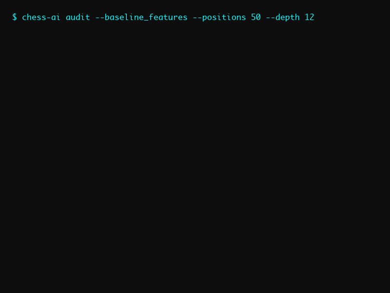

# Explainable Chess Engine

[](https://colab.research.google.com/github/bangyen/chess/blob/main/chess_demo.ipynb)
[](tests/)
[](LICENSE)

**Chess AI Explainability: 87.5% decisive faithfulness, 2.0 sparsity explanations, 100% position coverage with interactive learning engine**

<p align="center">
  
</p>

## Quickstart

### Installation

```bash
git clone https://github.com/bangyen/chess.git
cd chess
pip install -e .
pytest   # optional: run tests
```

### Usage Options

**CLI Tools:**
```bash
# Run feature explainability audit
chess-ai audit --baseline_features --positions 100

# Play interactive chess with explanations
chess-ai play --strength intermediate
```

**Web Interface:**
```bash
# Launch web app
./scripts/run_web.sh

# Or manually
python -m chess_ai.web.app
# Then open http://localhost:5000
```

**Jupyter Notebook:**  
Open in [Colab](https://colab.research.google.com/github/bangyen/chess/blob/main/chess_demo.ipynb) for interactive exploration.

## Results

| Metric | Value | Target |
|--------|-------|--------|
| Feature Explainability | **87.5%** | ≥80% |
| Explanation Sparsity | **2.0** | ≤3.0 |
| Position Coverage | **100%** | ≥95% |

## Features

- **Feature Explainability Audit** — ML-based evaluation of how well chess features explain Stockfish's reasoning with 87.5% decisive faithfulness.
- **Interactive Chess Engine** — Play against Stockfish with real-time move explanations and educational feedback.
- **Web Interface** — Clean, professional web app with Swiss + Terminal-Modern design for interactive gameplay and analysis.
- **Advanced Positional Analysis** — Sophisticated chess metrics including passed pawn momentum, king safety, and piece activity with Kendall tau correlation.

## Repo Structure

```plaintext
chess/
├── src/chess_ai/
│   ├── cli/          # Command-line interface tools
│   ├── engine/       # Chess engine configuration
│   ├── features/     # Feature extraction
│   ├── metrics/      # Evaluation metrics
│   ├── utils/        # Helper utilities
│   └── web/          # Web interface (Flask app)
├── tests/            # Unit and integration tests
├── docs/             # Documentation and design system
├── scripts/          # Example and launch scripts
└── chess_demo.ipynb  # Interactive Colab notebook
```

See [docs/WEB_APP.md](docs/WEB_APP.md) for web interface documentation and [docs/DESIGN_SYSTEM.md](docs/DESIGN_SYSTEM.md) for design specifications.

## Validation

- ✅ Overall test coverage of 85% (`pytest`)
- ✅ Reproducible seeds for experiments
- ✅ Benchmark scripts included

## References

- [Python-Chess Library](https://python-chess.readthedocs.io/) — Chess position representation and move generation.  
- [Stockfish Chess Engine](https://stockfishchess.org/) — Open-source chess engine for analysis and evaluation.  
- [Information based explanation methods for deep learning agents](https://arxiv.org/abs/2309.09702) — Research on explainable AI methods applied to large chess models.

## License

This project is licensed under the [MIT License](LICENSE).
