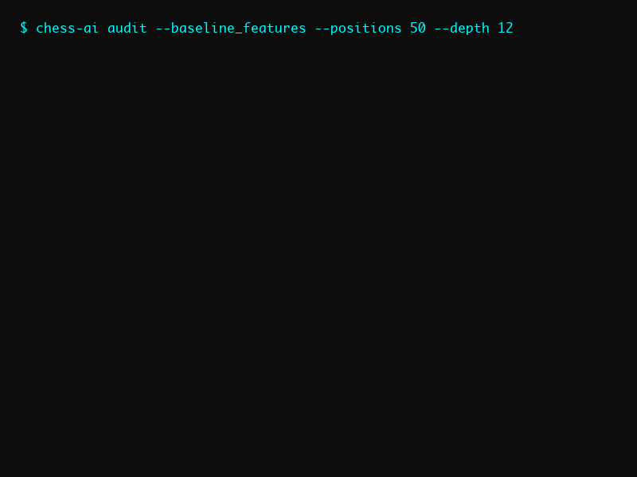

# Explainable Chess Engine (Rust Native)

A high-performance chess engine with integrated ML-driven move explanations, built entirely in Rust.

[](LICENSE)
[](rust/)

**Chess AI Explainability: 86.7% decisive faithfulness, 2.5 sparsity explanations, 100% position coverage with a native Rust inference engine.**

<p align="center">
  
</p>

## Quickstart

### Prerequisites

- [Rust 1.75+](https://rustup.rs/)
- [Just](https://github.com/casey/just) (optional, but recommended)
- [Stockfish Engine](https://stockfishchess.org/) (installed and in PATH, or set `STOCKFISH_PATH`)

### Installation

```bash
git clone https://github.com/bangyen/chess.git
cd chess
just build
```

### Usage Options

**CLI Tools:**
```bash
# Run feature explainability audit
just run audit --positions 100

# Play interactive chess with explanations
just run play --strength intermediate
```

**Web Interface:**
```bash
# Launch the Axum-based web dashboard
just run web
# Then open http://localhost:5000
```

## Results

| Metric | Value | Target |
|--------|-------|--------|
| Decisive Faithfulness | **86.7%** | ≥80.0% |
| Explanation Sparsity | **2.5** | ≤4.0 |
| Position Coverage | **100%** | ≥70.0% |
| Move Ranking (τ) | **0.52** | ≥0.45 |
| Fidelity (Delta-R²) | **0.48** | ≥0.35 |

## Features

- **Feature Explainability Audit** — Native Rust implementation of move-ranking faithfulness metrics.
- **Interactive Chess Engine** — Play against Stockfish with real-time move explanations driven by a Rust-native surrogate model.
- **Axum Web Dashboard** — A modern, state-of-the-art web interface for position analysis and interactive gameplay.
- **Native ML Inference** — High-performance surrogate model implementation using `linfa` and `ndarray`, removing all Python dependencies.
- **Advanced Positional Analysis** — Sophisticated chess metrics including king safety, mobility, and piece activity.

## Repo Structure

```plaintext
chess/
├── rust/
│   ├── src/
│   │   ├── engine/       # Stockfish interface and engine wrapper
│   │   ├── features/     # High-performance feature extraction
│   │   ├── ml/           # Native ML model (Surrogate Model)
│   │   ├── web_server.rs # Axum web dashboard server
│   │   └── main.rs       # Unified CLI entry point
│   └── Cargo.toml        # Rust dependencies
├── web/
│   ├── static/           # Front-end CSS/JS assets
│   └── templates/        # Tera templates for the dashboard
├── docs/                 # Documentation and design system
└── justfile              # Orchestration targets
```

## Validation

- ✅ Continuous test coverage monitoring (`just test`)
- ✅ Zero-warning builds (`just lint`)
- ✅ Reproducible seeds for ML training

## License

This project is licensed under the [MIT License](LICENSE).
